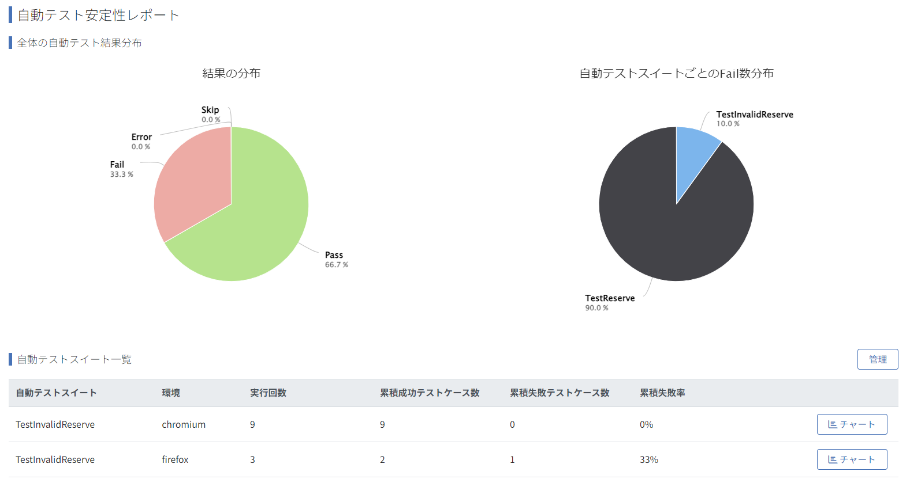

# Automated Test Stability Report Sync Action

This action integrates automated test results into the QualityForward Automated Test Stability Report.



## Inputs

### `api_key`

**Required**: Set the project API key for Quality Forward. <br> Be sure to use [Using secrets in GitHub Actions](https://docs.github.com/en/actions/security-for-github-actions/security-guides/using-secrets-in-github-actions) to configure it. <br>Please refer to the [API キーの発行手順](https://qualityforward.github.io/api-spec/#section/API/API) in the QualityForward API documentation for instructions on how to set up the API key.

### `file-path`

**Required**: Please configure the file path where the results of the automated tests are stored.

### `test-framework`

**Required**: Please configure the test framework used. It can be specified with a wildcard.

Supported Test Frameworks:

|  Test Framework   | File Extension |
| :---------------: | :------------: |
|       junit       |      xml       |
|      pytest       |      xml       |
| nodejs-playwright |      xml       |
| pytest-playwright |      xml       |
|     magicpod      |      json      |
| mabl-deploy-event |      json      |

*mabl-deploy-event: Data for [obtaining a summary of deployment results](https://api.help.mabl.com/reference/getexecutionresultforevent) (for details, refer to the mabl help page - [Deploy Events](https://help.mabl.com/hc/en-us/articles/17780788992148-Deployment-events)).<br>
*For other test frameworks that can output files in junit-xml format, set it to junit.

### `auto_test_suite_external_key`

Please configure the name of the automated test suite to be integrated.

Default automated test suite name if not specified:

|      Test Framework      | Default Automated Test Suite Name                                                                                                              |
| :----------------------: | :--------------------------------------------------------------------------------------------------------------------------------------------- |
| junit,nodejs-playwright  | The name attribute of the testsuite element                                                                                                    |
| pytest,pytest-playwright | The classname attribute of the testcase element<br>Taking the part after the last dot.<br>(Example) if test.testSuite, it fetches “testSuite”. |
|         magicpod         | Bulk Execution Setting Name for Tests                                                                                                          |
|    mabl-deploy-event     | Test Plan ID                                                                                                                                   |

### `auto_test_cycle_name`

Please set the automated test cycle name to integrate.

Default automated test cycle name if not specified:

|               Test Framework               | Default Automated Test Cycle Name            | Example                          |
| :----------------------------------------: | :------------------------------------------- | :------------------------------- |
|          junit,mabl-deploy-event           | Action Execution Date and Time               | 9/26/2024, 4:10:10 AM            |
| pytest,nodejs-playwright,pytest-playwright | timestamp attribute of the testsuite element | 2024-08-28T15:12:57.311996+09:00 |
|                  magicpod                  | End time of bulk test execution              | 2024-05-09T02:44:32Z             |

### `auto_execution_device_external_key`

Please set the automated test execution environment name to integrate.

Default automated test execution environment name if not specified:

|    Test Framework     | Default Automated Test Execution Environment Name                                                                                            |
| :-------------------: | :------------------------------------------------------------------------------------------------------------------------------------------- |
| junit,pytest,magicpod | `Standard environment`                                                                                                                       |
|   nodejs-playwright   | hostname attribute of the testsuite element                                                                                                  |
|   pytest-playwright   | Extracted from the name attribute of the testcase element. <br>(Example) if test_sample[chromium-data-driven], it fetches “chromium”         |
|   mabl-deploy-event   | The browser_type attribute of each journey_execution. <br> If the browser_type attribute is absent, it defaults to the standard environment. |

## Example usage

### OSS Test Framework

Execute the tests in advance and output an XML or JSON file, then use this action.

### When specifying a specific file

```yaml
steps:
  - name: Checkout repository
    uses: actions/checkout@v4

    # Run automated tests in advance (if necessary, configure to output test results in XML/JSON format).
  - name: Run tests
    run: pytest tests/ --junitxml=result.xml

    # Use this action based on the output file.
  - name: link Automated Test Results
    uses: QualityForward/test-stability-report-sync@v1.1.0
    with:
      file-path: result.xml
      test-framework: pytest-playwright
      api-key: ${{ secrets.API_KEY }}
```

### When specifying all files stored in a specific folder

\*Limited to **the same** test framework

```yaml
steps:
  - name: Checkout repository
    uses: actions/checkout@v4

  - name: Run tests
    run: pytest tests/ --junitxml=result.xml

  - name: link Automated Test Results
    uses: QualityForward/test-stability-report-sync@v1.1.0
    with:
      file-path: results/*.xml # Specify using a wildcard.
      test-framework: junit
      api-key: ${{ secrets.API_KEY }}
      auto_execution_device_external_key: chrome
```

### Paid testing tool.

Just like with [OSS test frameworks](#oss-test-framework), use this action after running the tests in advance.

\*Refer to the help page of each paid tool for execution methods.

#### MagicPod

Use the [magicpod-api-client](https://support.magic-pod.com/hc/en-us/articles/4408903744409-Run-batch-tests-from-the-command-line-Cloud-environment#h_01G8T9RVNHHGKP0Z51WHW9X6E3) to execute in bulk.

```yaml
jobs:
  RunMagicPod:
    runs-on: ubuntu-latest
    env:
      GH_TOKEN: ${{ secrets.GITHUB_TOKEN }}
    steps:
      - uses: actions/checkout@v4

      - name: Install Packages
        run: |
          sudo apt-get update
          sudo apt-get install -y unzip

      # Batch Execution in MagicPod
      - name: Batch Run Test
        env:
          MAGICPOD_API_TOKEN: ${{ secrets.MAGICPOD_API_TOKEN }}
        run: |
          OS=linux
          FILENAME=magicpod-api-client

          # Installation of magicpod-api-client
          curl -L "https://app.magicpod.com/api/v1.0/magicpod-clients/api/${OS}/latest/" -H "Authorization: Token ${MAGICPOD_API_TOKEN}" --output ${FILENAME}.zip

          # Unzipping a ZIP file
          unzip -q "${FILENAME}.zip" &
          UNZIP_PID=$!
          wait $UNZIP_PID

          # Setting Various Environment Variables for Use in MagicPod
          MAGICPOD_ORGANIZATION=Organization_Name
          MAGICPOD_PROJECT=Project_Name

          # Batch Execution of Tests
          ./magicpod-api-client.exe batch-run -t ${MAGICPOD_API_TOKEN} -o ${MAGICPOD_ORGANIZATION} -p ${MAGICPOD_PROJECT} -S Test_Settings_Number

          # Retrieve Test Numbers from Batch Execution
          BATCH_RUN_NUMBER=$(./magicpod-api-client latest-batch-run-no -t ${MAGICPOD_API_TOKEN} -o ${MAGICPOD_ORGANIZATION} -p ${MAGICPOD_PROJECT})

          # Export Batch Execution Results to JSON
          ./magicpod-api-client get-batch-run -t ${MAGICPOD_API_TOKEN} -o ${MAGICPOD_ORGANIZATION} -p ${MAGICPOD_PROJECT} -b ${BATCH_RUN_NUMBER} > results/batch_run_results.json

      # Integrate Automated Test Results Using Actions
      - name: link automated test results
        uses: QualityForward/test-stability-report-sync@v1.2.0
        with:
          file-path: results/batch_run_results.json
          test-framework: magicpod
          api-key: ${{ secrets.API_KEY }}
          auto_execution_device_external_key: Chrome
```

#### mabl デプロイイベント

Execute a Deployment Event Using the [mabl cli](https://help.mabl.com/hc/en-us/articles/17752848113556-Mabl-CLI-overview) and Integrate the Results.

```yaml
jobs:
  RunMablDeployEvent:
    runs-on: ubuntu-latest
    env:
      GH_TOKEN: ${{ secrets.GITHUB_TOKEN }}
      MABL_API_TOKEN: ${{ secrets.MABL_API_TOKEN }}
    steps:
      - uses: actions/checkout@v4

      - name: Install node.js
        uses: actions/setup-node@v4
        with:
          node-version: "20"

      # stallation of the mabl cli
      - name: Install and setup mabl-cli
        run: |
          npm install -g @mablhq/mabl-cli@latest
          mabl auth activate-key ${MABL_API_TOKEN}

      # xecuting a Deployment Event in mabl
      - name: Batch Run Test
        env:
          APPLICATION_ID: Application ID
          ENVIRONMENT_ID: Environment id
          LABEL: Label Name
        run: |
          set -euxo pipefail

          # MEMO: Temporarily Disable Stopping the Process When a Test Fails
          set +e
          mabl deployments create --application-id ${APPLICATION_ID} --environment-id ${ENVIRONMENT_ID} --labels ${LABEL} --await-completion -o json > results/mabl_result.json
          set -e

      # Integrate Automated Test Results Using Actions
      - name: link automated test results
        uses: QualityForward/test-stability-report-sync@v1.2.0
        with:
          file-path: results/mabl_result.json
          test-framework: mabl-deploy-event
          api-key: ${{ secrets.API_KEY }}
```
